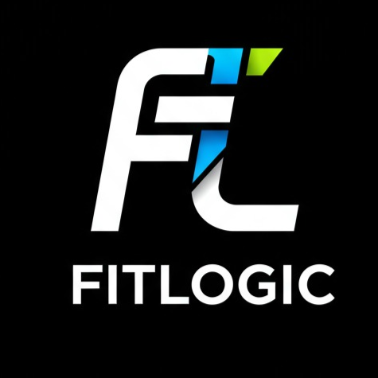

# 🏋️‍♂️ FitLogic: Data-Driven Personalized Fitness Planner

<p align="center">
  <a href="#"> 
  </a>
</p>

<div align="center">

[](https://opensource.org/licenses/MIT) [](https://nextjs.org/) [](https://dotnet.microsoft.com/) [](https://tailwindcss.com/) [](https://www.microsoft.com/en-us/sql-server/)

</div>

FitLogic is a modern, full-stack fitness platform that generates truly personalized, data-driven workout plans and smart exercise replacements. Built with **Next.js** and **.NET Core**, FitLogic focuses on solving the real-world problem of generic, ineffective fitness advice by leveraging robust backend logic, muscle targeting, and user context to deliver plans that actually fit you.

---

## 📚 Table of Contents

- ✨ [Key Features](#-key-features)
- 🚀 [Demo](#-demo)
- 🧰 [Tech Stack](#-tech-stack)
- 🎬 [Getting Started](#-getting-started)
  - 📦 [Backend Setup](#-backend-setup)
  - 💻 [Frontend Setup](#-frontend-setup)
- 🔐 [Environment Variables](#-environment-variables)
- 📁 [Project Structure](#-project-structure)
- 📡 [API Endpoints](#-api-endpoints)
- 🤝 [Contributing](#-contributing)
- 📝 [License](#-license)

---

## ✨ Key Features

FitLogic is designed to solve the problem of cookie-cutter fitness plans by providing:

- 🧠 **Smart Exercise Replacement**: Suggests alternative exercises that target the same muscle or sub-muscle, never repeating an exercise in the same day, and always prioritizing anatomical correctness and user context.
- 🏋️‍♀️ **Personalized Workout Generation**: Plans are built around your goals, skill level, and schedule, with robust fallback and randomization to ensure variety and effectiveness.
- 🔄 **Dynamic Enum & Goal Handling**: All fitness goals and types are handled robustly, supporting new types like "Bodyweight" and always using consistent, lowercase values.
- ⚡ **Performance Optimized**: Backend leverages SQL indexes and efficient queries for fast response, even with large exercise databases.
- 📊 **Data-Driven Decisions**: Every replacement and plan is based on real muscle group, sub-muscle, and user data, not just random selection.
- 📱 **Modern, Responsive UI**: Built with Next.js and Tailwind CSS for a seamless experience on any device.
- 🧩 **SOLID, Modular Backend**: Clean, maintainable, and extensible .NET Core backend following best practices.

---

## 🚀 Demo

{you can find the video in images/fitlogicprivew }

*Watch the video above to see how FitLogic solves the problem of generic fitness plans by providing truly smart, context-aware exercise replacements and personalized workouts. The demo highlights the robust backend logic that ensures every suggestion is anatomically correct, never repeated, and always tailored to the user's needs.*

---

## 🧰 Tech Stack

### Frontend
- **[Next.js](https://nextjs.org/)**
- **[React](https://react.dev/)**
- **[Tailwind CSS](https://tailwindcss.com/)**
- **[Headless UI](https://headlessui.dev/)**

### Backend
- **[.NET Core Web API](https://dotnet.microsoft.com/)**
- **[Entity Framework Core](https://learn.microsoft.com/en-us/ef/core/)**
- **SQL Server**

---

## 🎬 Getting Started

Follow these instructions to set up and run FitLogic on your local machine.

### 📦  Backend Setup

1. **Clone the repository:**
   ```sh
   git clone https://github.com/yourusername/fitlogic.git
   cd fitlogic/BackEnd
   ```
2. **Configure your database:**
   - Update `appsettings.json` with your SQL Server connection string.
3. **Run migrations:**
   ```sh
   dotnet ef database update
   ```
4. **Start the backend server:**
   ```sh
   dotnet run
   ```
   The API will be available at `https://localhost:5001` (or as configured).

---

### 💻  Frontend Setup

1. **Navigate to the frontend directory:**
   ```sh
   cd ../frontend
   ```
2. **Install dependencies:**
   ```sh
   npm install
   ```
3. **Set up environment variables:**  
   Create a `.env.local` file and add:
   ```
   NEXT_PUBLIC_BACKEND_API_URL=https://localhost:5001
   ```
4. **Run the development server:**
   ```sh
   npm run dev
   ```
   The app will be available at `http://localhost:3000`.

---

## 🔐 Environment Variables

**Frontend:**
- `NEXT_PUBLIC_BACKEND_API_URL` – URL of your backend API

**Backend:**
- `ConnectionStrings:DefaultConnection` – SQL Server connection string
- JWT secret keys, etc. (see `appsettings.json`)

---

## 📁 Project Structure

FitLogic follows a clear and organized project structure, separating the backend and frontend into distinct directories to promote modularity and ease of development.

```
FitLogic/
│
├── BackEnd/         # .NET Core Web API
│   ├── Controllers/
│   ├── Models/
│   ├── Data/
│   └── ...
│
└── frontend/        # Next.js app
    ├── src/
    ├── components/
    ├── public/
    └── ...
```

---

## 📡 API Endpoints

**Workout**
- `POST /api/Workout/SmartChange` – Get a smart replacement for an exercise
- `POST /api/Workout/GeneratePlan` – Generate a personalized workout plan

**Calories**
- `POST /api/Calories/Calculate` – Calculate calories and macros

*(See backend controllers for full details.)*

---

## 🤝 Contributing

Pull requests are welcome! For major changes, please open an issue first to discuss what you would like to change.

---

## 📝 License

This project is licensed under the MIT License - see the [LICENSE](LICENSE) file for details.

---

**Made with 💪 by the FitLogic Team**
